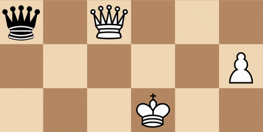

    
  
  <h1>
    EvalGuessr - a chess game to flex your evaluation skills
     
  </h1>      

  

This came together in a one-weekend-only game challenge amongst a group of developers. I used the Lichess Developer API to pull over 100,000 games from their database. The game then takes a random game and a random position from that game and uses my own instance of Stockfish to evaluate the current position, taking into account what color's turn it is and the position of the pieces. It turns this data into a json package to deliver to the React client and allows the user to guess and ultimately get a score at the end.
     
  

  

   <strong>CSS</strong>&nbsp;  &nbsp; &nbsp; <strong>Vanilla</strong> &nbsp;  &nbsp; &nbsp;  <strong>React</strong> &nbsp;  &nbsp; &nbsp; <strong>NodeJS</strong> &nbsp;  &nbsp; &nbsp; 
  

   
  

      
    
    
  

 
  
   

 

> Please take note that this project was completed as part of a challenge and so is not very clean code. If you would like to fork this, I would recommend doing a lot of spring cleaning on this code first!

## Table of Contents

## Installation

### Requirements

- A server to host the Node App
- A place to host the React client
 
### Steps

1) Host the Node server!
2) Host the React app!
3) Change your API url in `App.js` to match your Node instance.
4) Play!
   
## Features

- Over 100,000 games to pull from with each game having many positions to play from
- Ignores the beginning of games so positions are interesting
- Ignores the end if there is an imminent checkmate to avoid obvious easy wins
- Calculates both a score and a time - you can work on your accuracy or speed depending on what you feel like you want to improve!
 

  
## FAQ

### Do you plan on making a next version where you spend more time on it?
> I've gone back and forth on this. At this time, I like leaving it as a pure example of what I was able to accomplish in a single weekend. Perhaps at some point that novelty will wear off and I will make this much more of a full fledged application.

### I disagree with an evaluation!
> If you're using another engine to compare (or even an updated version of Stockfish!), they might come to different evaluations of the position. I am using Stockfish v10 to evaluate the positions. 

### I mostly like what you've done, but I want to tweak a few things. Can I fork this and use it myself?

> Of course you can! I initially made this tool primarily for myself, but have released it to the wild to help anyone. Take it, change it, morph it and squash it to your heart's desire. 
